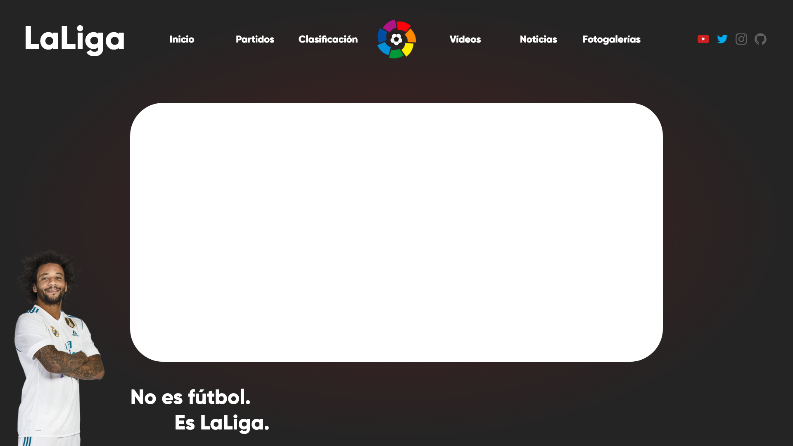
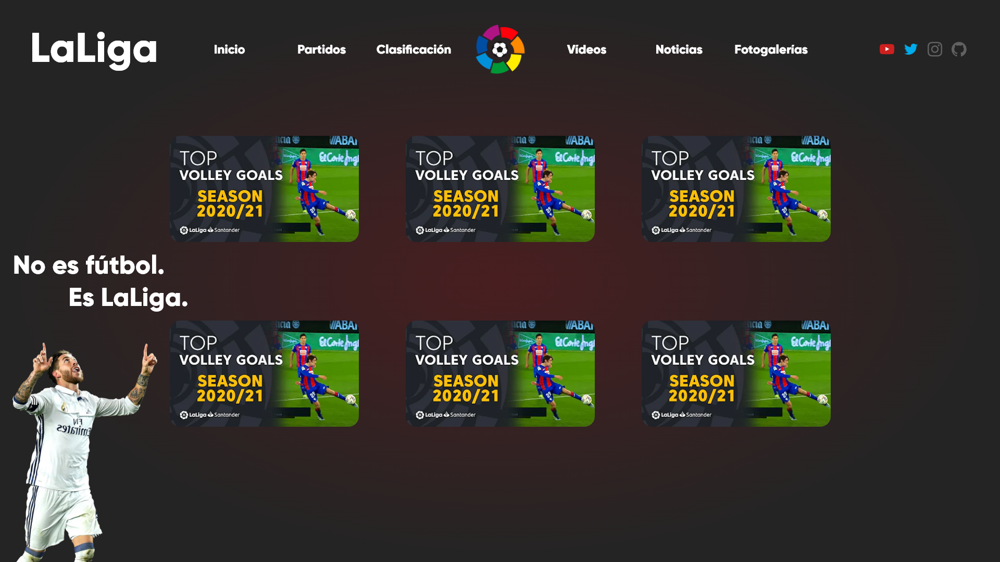
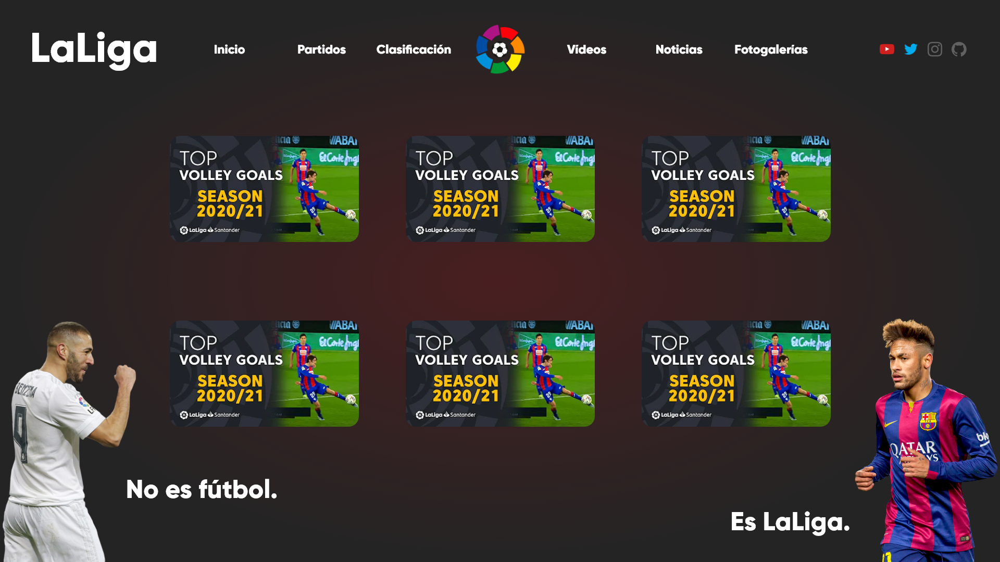

<!-- LOGO -->
<p align="center">
  <a href="https://github.com/shady2310/LaLiga-WebProject">
    
  </a>

  <h3 align="center">LaLiga WebProject</h3>

  <p align="center">
    Descripción del proyecto
    <br />
    <a href="https://github.com/shady2310/LaLiga-WebProject/blob/master/README.md"><strong>ReadMe »</strong></a>
    <br />
    <br />
    <a href="https://github.com/shady2310/LaLiga-WebProject">Ver archivos</a>
    ·
    <a href="https://github.com/shady2310/LaLiga-WebProject/issues">Reportar Bug</a>
    ·
    <a href="https://github.com/shady2310/LaLiga-WebProject/issues">Solicitar funcionalidad</a>
  </p>
</p>

---

<!-- CONTENIDO -->
<details open="open">
  <summary><h2 style="display: inline-block">Contenido</h2></summary>
  <ol>
    <li>
      <a href="#sobre-el-proyecto">Sobre el proyecto</a>
      <ul>
        <li><a href="#built-with">Built With</a></li>
        <li><a href="#otras-tecnologías">Otras tecnologías</a></li>
      </ul>
    </li>
    <li><a href="#descripción-funcional">Descripción funcional</a></li>
    <li><a href="#descripción-técnica">Descripción técnica</a></li>
    <li><a href="#wireframes">Wireframes</a></li>
    <li><a href="#roadmap">Roadmap</a></li>
    <li><a href="#contribuir">Contribuir</a></li>
    <li><a href="#to-do">To Do</a></li>
    <li><a href="#versiones">Versiones</a></li>
  </ol>
</details>

---

<!-- Sobre el proyecto -->

## Sobre el proyecto

**Descripción del proyecto:**

El proyecto consistía en desarrollar una Web en la que poder consultar los datos de los partidos, clasificación y estadísticas de La Liga Santander.

A su vez, como extra, se diseñaron más apartados en la web con diferentes funcionalidades, como filtros a las tablas y otras instancias de navegación, como las noticias, la Landing Page, zona de vídeos y fotogalerías.

Y otras cosas más que se explican más adelante.

<div align="center">

### Built With


### Otras tecnologías


</div>


---

<!-- Descripción funcional -->

## Descripción funcional

<h3 align="center">
<strong>Características principales</strong>
</h3>

**Página principal**

Cuando entras por primera vez a la web te encuentras con la página de bienvenida, en la cual en caso de que LaLiga no haya comenzado te mostrará un contador para el inicio de la misma, en caso contrario el contador desaparecerá automáticamente.

<div align="center">

</div>

<br>

<div align="center">
<h4><strong>LaLiga Santander</strong></h4>
</div>

**Partidos y clasificación:**

Aquí podemos encontrar toda la información sobre los partidos y la clasificación de cada uno de los equipos en la competición. Además encontraremos varios filtros que nos permiten hacer una búsqueda más precisa y cómoda del equipo que más nos interese.

<div align="center">


</div>

<br>

**Noticias:**

Esta sección se encuentra aún en desarrollo.

<br>

**Vídeos:**

Aquí podemos encontrar una diferente variedad de vídeos relacionados con la competición.

<div align="center">

</div>

<br>

**Fotogalerías:**

Aquí encontramos diferentes galerías publicadas por temas, dentro de cada una podemos encontrar un carrusel con las imágenes descritas en cada uno de los títulos.

<div align="center">


</div>

<br>

**Estadisticas:**

Por último tenemos la tabla de estadísticas, en ella podemos encontrar listados los 20 equipos que participan en LaLiga Santander. Además contamos con información relevante al rendimiento de los equipos en la tabla.

<div align="center">

</div>

<br>

---

<!-- Descripcion técnica -->

## Descripción técnica

### Home Page:

En la página de inicio tenemos un contador que se encarga de indicar el tiempo que queda para el inicio de LaLiga, está pensado para que se le asigne la fecha de inicio y al llegar a la misma ocultarse automáticamente y detener su ejecución:

```js
let intervalo = setInterval(cuentaAtras, 1000); // Se establece un intervalo de ejecución de la función cada segundo para actulizar el contador

//Llamamos a todos los elementos del DOM que forman parte del contador
let ocultarContador = document.getElementById("cuenta__contenedor");
const diasEL = document.getElementById("dias");
const horasEL = document.getElementById("horas");
const minutosEL = document.getElementById("minutos");
const segundosEL = document.getElementById("segundos");

// Establecemos la fecha de fin del contador o fecha de inicio del evento (LaLiga en este caso)
const fecha = "13 Aug 2021";

function cuentaAtras() {
  const fechaInicio = new Date(fecha); // Tomamos la fecha indicada
  const fechaActual = new Date(); // Obtenemos la fecha actual

  //Obetenemos cada uno de los datos haciendo una operación matematica y lo redondeamos al mínimo número redondo con el "Math.floor"
  const totalSegundos = (fechaInicio - fechaActual) / 1000;
  const dias = Math.floor(totalSegundos / 3600 / 24);
  const horas = Math.floor(totalSegundos / 3600) % 24;
  const minutos = Math.floor(totalSegundos / 60) % 60;
  const segundos = Math.floor(totalSegundos) % 60;

  diasEL.innerHTML = dias;
  horasEL.innerHTML = dosdigitos(horas);
  minutosEL.innerHTML = dosdigitos(minutos);
  segundosEL.innerHTML = dosdigitos(segundos);

  // Aquí ocultamos el contador cuando a alcanzado la fecha establecida
  if (fechaInicio <= fechaActual) {
    console.log(`La Liga ya ha empezado!`);
    clearInterval(intervalo); // Detenemos el intervalo de ejecución de la función para evitar un loop infinito
    ocultarContador.style.display = "none";
  }
}
// Para tener un aspecto uniforme con todos los digitos añadimos un cero si el numero es menor que 10
function dosdigitos(time) {
  return time < 10 ? `0${time}` : time;
}
```

<br>

### Obtención de datos:

Para obtener los datos en tiempo real hacemos uso de una **API**.

En cada tabla usamos el **Fetch** para la obtención de los datos.

Documentación de la **API** utilizada: [Documentación](https://www.football-data.org/documentation/quickstart).

Para comunicarnos con la **API** utilizamos un fetch dentro de una función async (asíncrona).

- Fetch

  ```js
  async function datos() {
    const url = "https://api.football-data.org/v2/competitions/2014/matches"; // Url de la API
    const token = "XXXXX"; // Token privado proporcionado por la API
    const header = {
      method: "GET", // Utilizamos el método GET para la obtección de los datos
      headers: {
        "X-Auth-Token": token, // Añadimos el token
      },
    };
    const response = await fetch(url, header); // Esperamos la respuesta del Fetch con un "Await"

    const data = await response.json(); // Recibimos los datos en formato ".json"

    FuncionEjemplo(data); // Aquí ejecutamos cada una de las funciones que utilizamos en el código
  }
  ```

### Proceso de carga de los datos

Al recibir los datos mediante el fetch debido a que hacemos una llamada a una API externa añadimos un **Spinner** que se ejecuta cuando hacemos la llamada y termina su ejecución al recibir los datos. Está separado en dos funciones, una que se encarga de crear el Spinner y otra eliminarlo.

- Código del Spinner

  ```js
  // Mostramos el Spinner
  function loader() {
    let loader = document.getElementById("contenedor__loader");
    loader.style.visibility = "block";
  }
  // Ocultamos el Spinner
  function borrarLoader() {
    let loader = document.getElementById("contenedor__loader");
    loader.style.visibility = "hidden";
  }
  ```

  <div align="center">
  
  </div>

### Filtros

Contamos con diferentes filtros, en la tabla de resultados y en la tabla de estadísticas.

#### Filtros de la tabla resultados:

Aquí tenemos la posibilidad de filtrar por el nombre de cada equipo y por las jornadas de juego.

<div align="center">
  
</div>

- Filtrado por nombre:

  ```js
  // Para actualizar la búsqueda utilizamos previamente un "addEventListener" con "keyup" para que se ejecute cada vez que introducimos un caracter

  function busqueda(partidos) {
    // En caso de que no introduzcamos ningún nombre nos volverá a generar la tabla principal
    if (inputBusqueda.value == "") {
      tablaPartidos(partidos);
    }
    // Filtramos los equipos por su nombre con ".filter" y hacemos uso de ".toLowerCase()" para que busque el nombre aunque se introduzcan mayusculas o minusculas en el input
    let datosFiltrados = partidos.filter((nombres) => {
      return (
        nombres.homeTeam.name
          .toLowerCase()
          .includes(inputBusqueda.value.toLowerCase()) ||
        nombres.awayTeam.name
          .toLowerCase()
          .includes(inputBusqueda.value.toLowerCase())
      );
    });

    // Hacemos uso de alertas para indicar al usuario cuando no está haciendo la búsqueda correctamente
    if (datosFiltrados.length == 0) {
      document.getElementById("noExiste").style.display = "block";
    } else if (datosFiltrados.length != 0) {
      document.getElementById("noExiste").style.display = "none";
    }

    // Aquí enviamos los datos filtrados a la función que crea nuestra tabla
    tablaPartidos(datosFiltrados);
  }
  ```

- Filtro por jornada:

  ```js
  // Para filtrar por jornada utilizamos un input de tipo number y le añardimos un botón para buscar con un "addEventListener" y un "click" para ejecutar la función

  function jornadas(partidos, jornadaSeleccionada) {
    let partidosSeleccionados = partidos.filter((partido) => {
      return partido.matchday === jornadaSeleccionada; // Se encarga de comparar el número introducido en el input con la jornada del partido
    });
    tablaPartidos(partidosSeleccionados);
  }

  // Hacemos también uso de alertas para indicar al usuario el correcto uso del botón buscar en caso de que no haya introducido ningún dato (Esto se ejecuta en otra parte del código)

  buscaJornada.addEventListener("click", function () {
  jornadas(data.matches, parseInt(selectorJornadas.value));
  if (selectorJornadas.value == "") {
    document.getElementById("errorJornada").style.display = "block";
  } else if (selectorJornadas.value != "") {
    document.getElementById("errorJornada").style.display = "none";
  }
  ```

<br>

#### Filtros de la tabla de estadisticas:

En esta tabla por defecto tenemos listados todos los equipos (20), podemos listar gracias a unos botones los primeros 5 equipos (los 5 equipos con mejores estadísticas) y contamos con otro botón para volver a listar los 20 equipos para que no sea necesario recargar la página.

<div align="center">
  
</div>

- Top 20:

  ```js
  // Vuelve a ejecutar la creación de la tabla con sus datos
  let botonTop20 = document.getElementById("top20");

  botonTop20.addEventListener("click", function () {
    crearTablaEstadisticas(datosEstadisticas);
  });
  ```

- Top 5:

  ```js
  //Hacemos uso del "slice(0, 5)" para mostrar solo los primeros 5 equipos de nuestro Array
  function top5() {
    let top5 = datosEstadisticas.slice(0, 5);
    crearTablaEstadisticas(top5);
  }

  // Hacemos la búsqueda del botón el DOM y usamos el "addEventListener" y el "click" para esperar la interacción del usuario
  let botonTop5 = document.getElementById("top5");
  botonTop5.addEventListener("click", function () {
    top5(datosEstadisticas);
  });
  ```

<br>

### Creación de las tablas con los datos

1. Creamos los elementos del **HTML** de manera dinámica con **JavaScript**.
2. Posteriormente asignamos los datos obtenidos a las variables que luego utilizaremos para crear bucles con **".forEach()"**.
3. Por último hacemos una conexión con los "elementos padres" y usamos **".appendChild()"** para la creación del **HTML**.

- Ejemplo de la tabla de Clasificación:

  ```js
  function tablaClasificacion(arrayclasificacion) {
    let tbody__clasificacion = document.getElementById("tbody__clasificacion"); // Ubicación en el DOM donde se va crear la tabla

    // Recorrido por todo el Array y buscando cada uno de los datos que nos interesan
    for (let i = 0; i < arrayclasificacion.length; i++) {
      const tr = document.createElement("tr");

      let posicion = arrayclasificacion[i].position;

      let equipo = arrayclasificacion[i].team.name;

      let img = document.createElement("img");
      img.src = arrayclasificacion[i].team.crestUrl;

      tr.appendChild(img);
      img.classList.add("img");

      let puntos = arrayclasificacion[i].points;

      let pj = arrayclasificacion[i].playedGames;

      let pg = arrayclasificacion[i].won;

      let pe = arrayclasificacion[i].draw;

      let pp = arrayclasificacion[i].lost;

      let datosClasificacion = [posicion, img, equipo, puntos, pj, pg, pe, pp];

      datosClasificacion.forEach((elemento) => {
        const td = document.createElement("td");
        td.append(elemento);
        tr.appendChild(td);
        tbody__clasificacion.appendChild(tr);
      });
    }
  }
  ```
<br>

---

## Wireframes

Respecto al diseño se realizó una aproximación del diseño deseado. El diseño final es un poco diferente debido a las modificaciones y requisitos posteriores que se le asignaron al proyecto:

<div align="center">


</div>

<br>

<div align="center">


</div>

<br>

<div align="center">


</div>

<br>

La idea es seguir desarrollando la web para integrar el aspecto deseado o pensado previamente en los wireframes para conseguir el resultado final.

<br>

---

<br>
<!-- ROADMAP -->

## Roadmap

Consulta las [Issues](https://github.com/shady2310/LaLiga-WebProject/issues) para obtener una lista de las funciones propuestas (y problemas conocidos).

<br>

---

<br>
<!-- Contribuir -->

## Contribuir

Las contribuciones son lo que hacen que la comunidad de código abierto sea un lugar increíble para aprender, inspirar y crear. Cualquier contribución que hagas es **muy apreciada**.

1. Fork the Project
2. Create your Feature Branch (`git checkout -b feature/AmazingFeature`)
3. Commit your Changes (`git commit -m 'Add some AmazingFeature'`)
4. Push to the Branch (`git push origin feature/AmazingFeature`)
5. Open a Pull Request

<br>

---

<br>
<!-- TO DO -->

## TO DO

- Trabajar en la mejora del responsive.
- Añadir ligas extranjeras.
- Terminar la sección de noticias, opción de añadir si es posible una API de noticias deportivas.

<br>

---

<br>
<!-- Versiones -->

## Versiones

- v1.0 (Release) (10/08/2021)
- v1.1 (Solución error en el bucle del contador, había bucle infinito) (11/08/2021)
- v1.2 (Cambios de bucle FOR por forEach() en los casos posibles) (12/08/2021)
